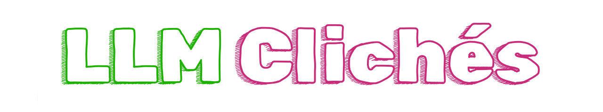

# llm-cliches

A collection of commonly used clichés and phrases in Large Language Models (LLMs) outputs.

- [adjectives.txt](adjectives.txt) - Words that describe or modify nouns.
- [nouns.txt](nouns.txt) - Words that identify people, places, things, or ideas.
- [verbs.txt](verbs.txt) - Action words that describe what something or someone does.
